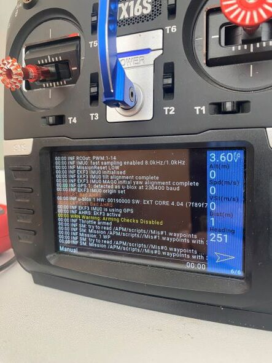

# LUAscript for ArduPilot

LUA script fo Ardupilot / Скрипты для Ardupilot :
* MultiMissiomSelect.lua  -  3 missions selection / Выбор из 3х миссий (для переключателя на 3 позиции)
   1. задать 1 для SCR_ENABLE
   2. сохранить в папке /APM/scripts/ сам скипт и файлы миссий (3 шт.)
   3. Задать значение 300 для RCx_OPTION(х номер канала на котором 3х позиционный переключатель) 
   4. перезагрузить контроллер
* SwitchMission.lua       -  2 or more missions select / Выбор от 2х или более миссий 
   1. задать в MP 1 для SCR_ENABLE
   2. сохранить в папке /APM/scripts/ сам скипт
   3. сохранить в папке /APM/scripts/missions файлы миссий(имена SM_Mission#0,SM_Mission#1,...)
   4. параметр RCx_OPTION задать 300(где х номер канала на котором тумблер/кнопка)
   5. в скрипте параметр POSITIONS задать 1 для кнопки(бесконечное число миссий) или 2,3,4,5... количество положений переключателя и мииссий соответственно 
   6. перезагрузить контроллер

Пример работы у меня на канале https://youtu.be/pAMMpPhNr5s
